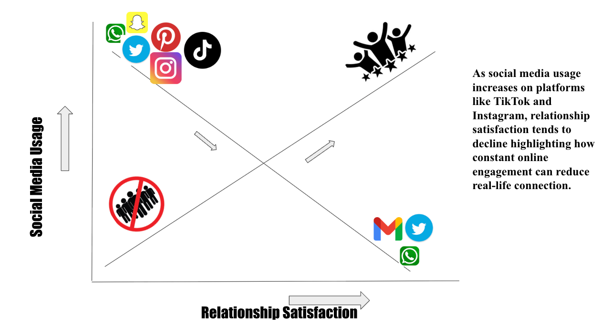

In this episode, we explore how social media shapes modern relationships — from staying connected across distances to the growing issue of digital distraction. Using data and personal reflections, we discuss how constant online engagement can strengthen virtual ties but weaken real-life connection. 

Below, our visualization shows the inverse relationship between social media use and relationship satisfaction — as time on platforms like TikTok and Instagram increases, meaningful in-person interactions tend to decline. Same as demand and supply theory.
